<h1>Marble-Shooting-RC-Tank</h1>

 ### [YouTube Demonstration](https://youtube.com/shorts/g7VrVGm-oIQ?feature=share)

<h2>Description</h2>
Designed and built a fully custom RC tank, including the metal body, DIY tank tread, drivetrain, and rotating marble-launching turret. The vehicle is controlled using an Arduino Mega and a FlySky RC controller. The project involved CAD modeling, metalworking with a bandsaw, mechanical design, microcontroller programming and electronics integration.
 

<h2>Languages and Utilities Used</h2>

- <b>Bandsaw</b>

- <b>Arduino</b>
  
- <b>OnShape</b>
<h2>Design and Build Process:</h2>

Running Gear Design:
 
 
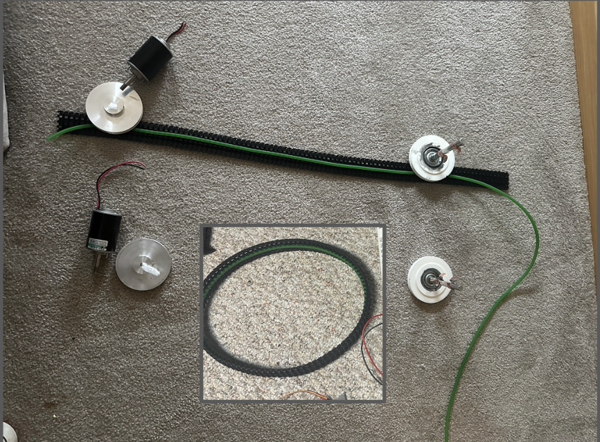
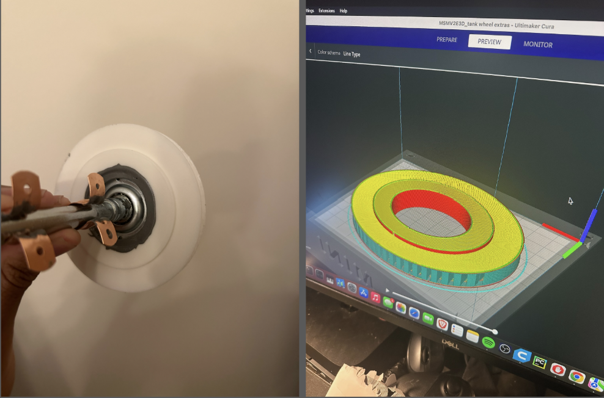
 
The tank running gear system was built using repurposed tracks from a model toy vehicle combined with reinforced conveyor-belt wire. Metal pulleys were directly connected to two 24V DC motors and functioned as the drive sprockets. The idler wheels used garage door rollers as wheel bearings, each connected to a CAD-modeled and 3D-printed outer wheel with integrated pulley grooves to keep the tracks aligned during operation. Epoxy was used to bond the mounting brackets and 3D-printed outer wheels to the garage door rollers, creating a functional running gear system.
 

Mounted Running Gear:
 
 
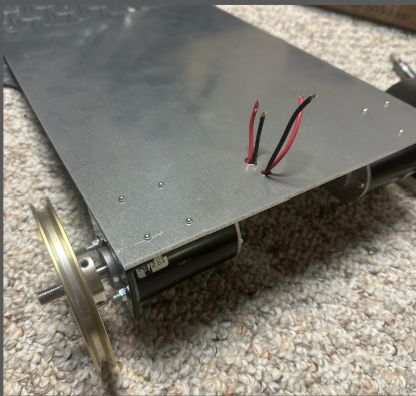
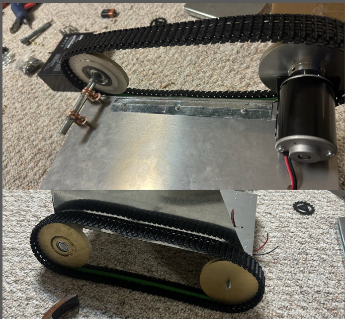
 
Wiring access holes were drilled through the 1/8-inch metal chassis plate, and the drive motors were mounted using metal brackets and rivets for a strong connection. The rear idler wheels were mounted using spacers connected to custom copper brackets with screws to keep the running gear aligned and securely attached to the frame. The tank tracks were tensioned around the drive sprocket and rear idler wheel to create the tracked drivetrain.
 

Turret:
 
 
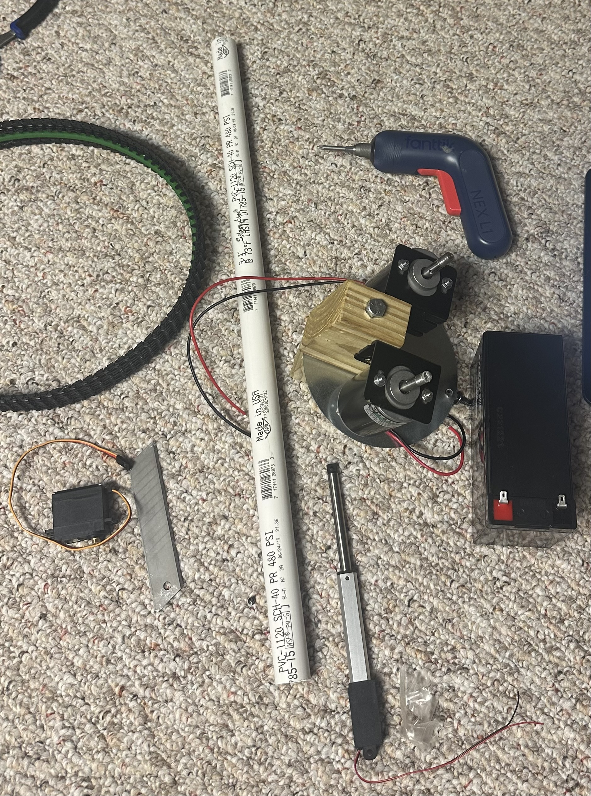
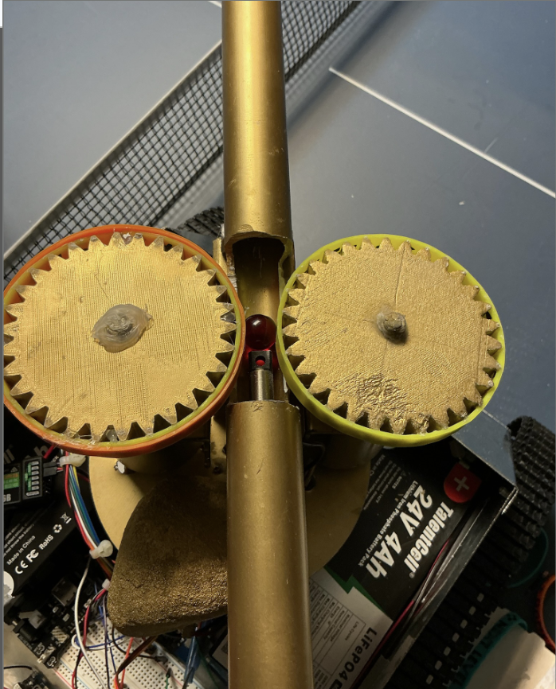

The turret assembly was built using a PVC pipe barrel, two 24V DC motors, a servo motor for turret rotation, and a linear servo used as a loading mechanism. Up to five marbles could be loaded into the PVC barrel, where the linear servo pushed them between two rotating 3D-printed gears wrapped in rubber, to launch the projectiles.
 

Body:
 
 
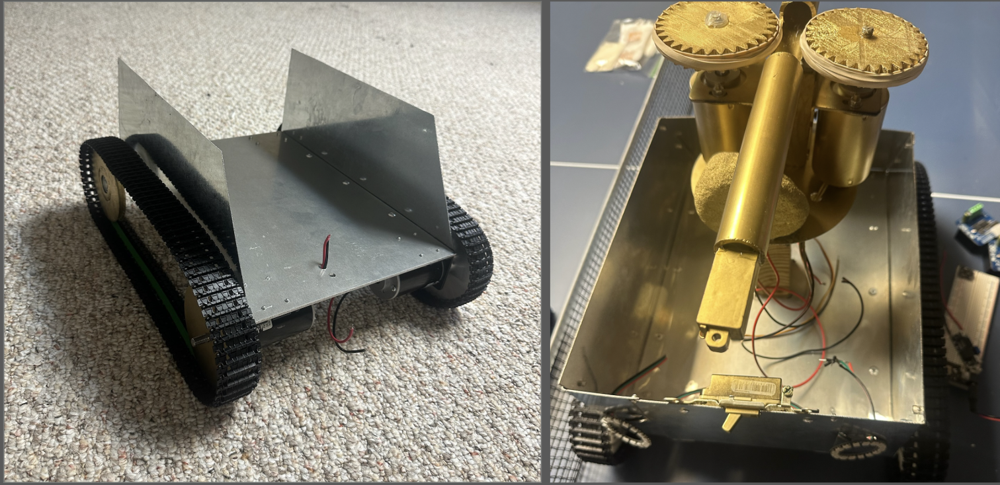

The tank body was created from sheet metal that was cut to shape using a metal bandsaw and assembled using rivets. Internal components including the kill switch, turret assembly, and rear LEDs were then mounted inside on top of a clear plastic sheet to help prevent electrical shorts between the electronics and metal chassis.
 

Electronics:
 
 
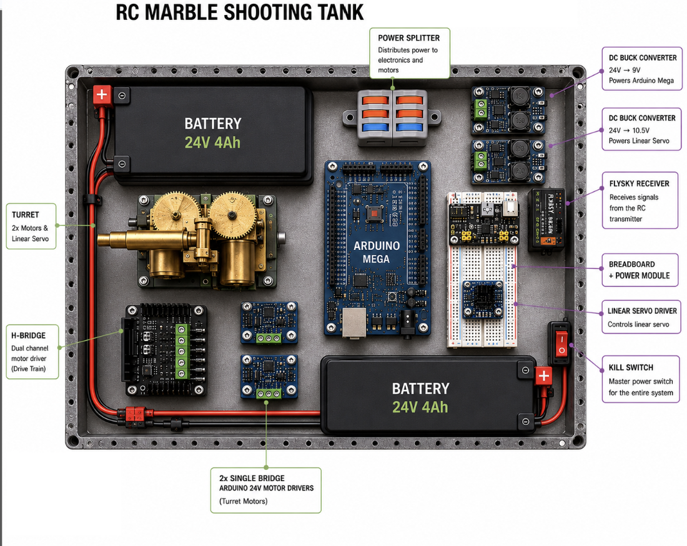
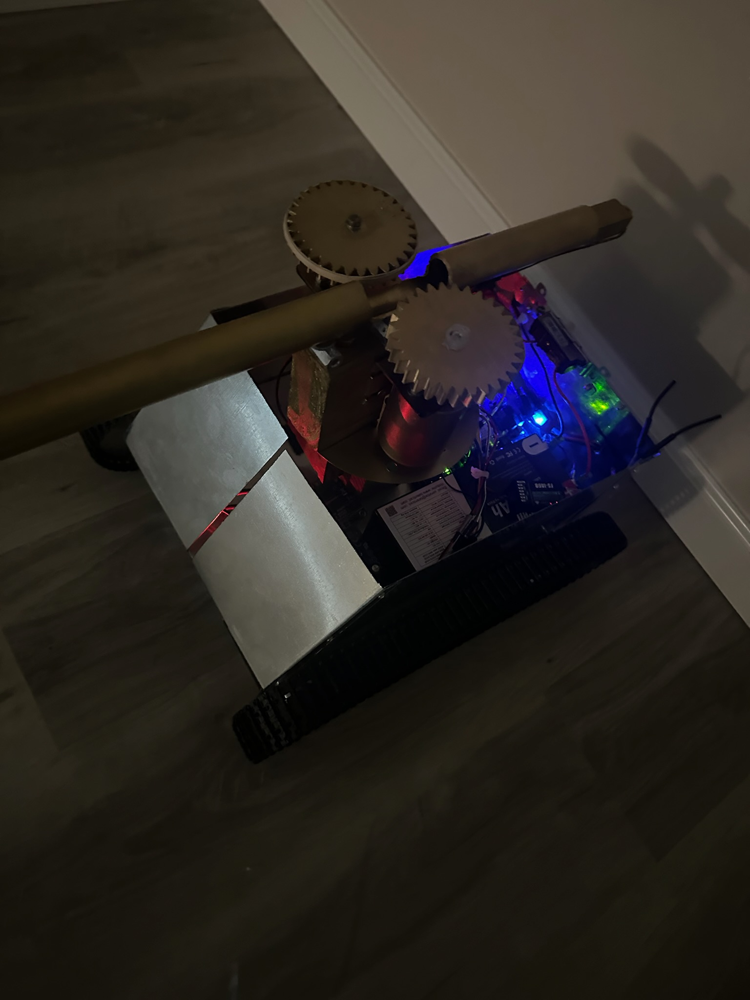

The electronics system was built around an Arduino Mega and a FlySky RC receiver to control the drivetrain, turret rotation, and firing system. Two 24V battery packs wired in parallel powered the tank, while buck converters regulated voltage for the Arduino and linear servo. One dual H-bridge motor driver and two single motor drivers were mounted inside the chassis to control the four 24V DC motors used for the turret and tracked drivetrain. 

Key Code Components:
 
 
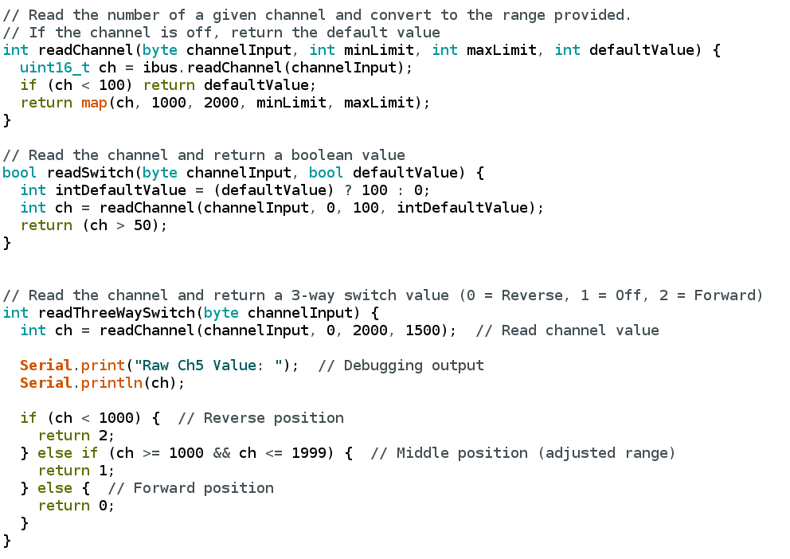
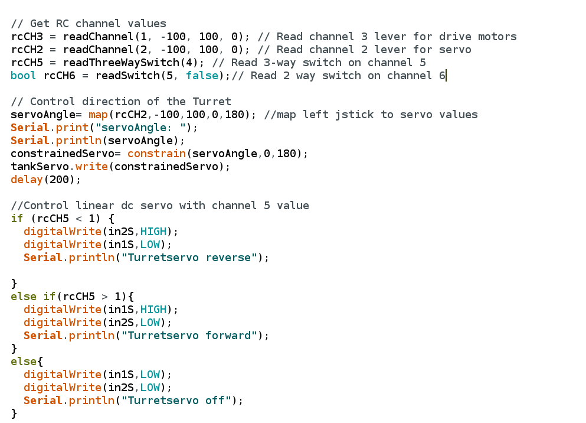
 

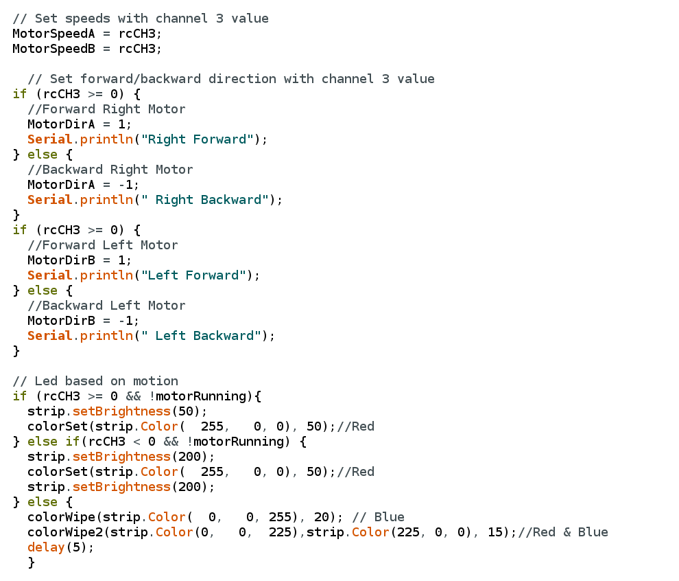

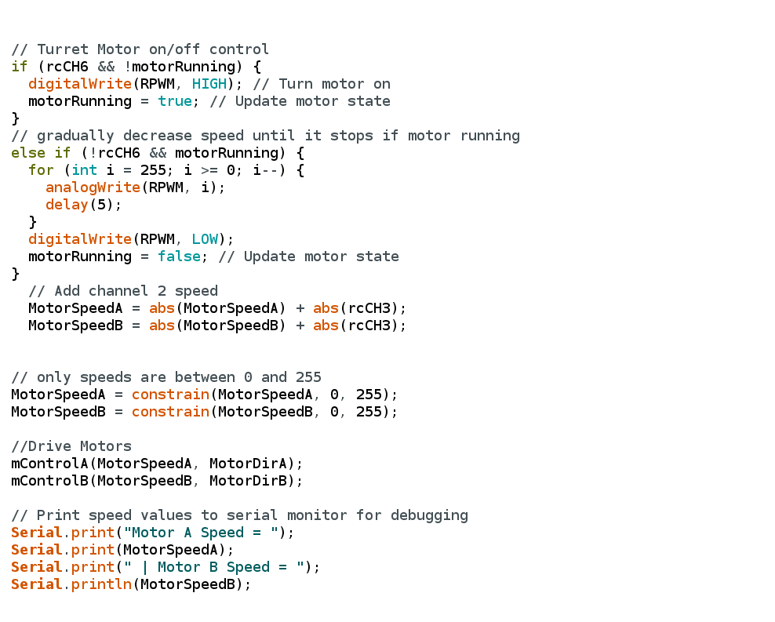
The Arduino Mega receives commands from the FlySky RC receiver and controls the tank’s drivetrain, turret rotation, and firing system. Joystick inputs are converted into motor speeds and directions for steering. The program also manages turret motor operation with smooth acceleration and deceleration, preventing abrupt stops of the 24v turret motors. LED indicators and serial monitor outputs were added to provide status feedback and simplify troubleshooting during testing.
    
<h1>Author</h1>

Designed and built by [Paul Bolder](https://github.com/Pbolder).
